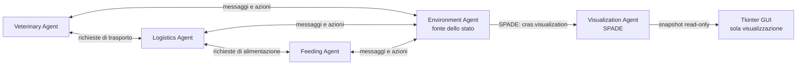

# Architettura proposta

## Stato di implementazione

**Architettura implementata fino alla Fase 6.** Sono stati implementati i confini architetturali
descritti in questo documento:

- `domain/`: entità tipizzate, stati finiti e comandi;
- `environment/`: griglia autorevole, validazione atomica, snapshot ed eventi;
- `messaging/`: payload JSON versionati e metadata FIPA;
- `agents/`: ruoli SPADE-BDI, `EnvironmentAgent` e `VisualizationAgent`;
- `visualization/`: proiezione immutabile e cronologia leggibile;
- `gui.py`: vista Tkinter alimentata soltanto dal Visualization Agent.

La simulazione integrata si avvia con `python -m tamagotchi_wild`; aggiungendo
`--gui` si apre la vista live. I test si eseguono con `python -m pytest`.

## Principio guida

Separare tre responsabilità: **decidere**, **modificare il mondo** e **visualizzare**. Gli agenti BDI decidono; l'ambiente valida e applica le azioni; la GUI mostra una copia dello stato.



## Componenti

| Componente | Responsabilità | Non deve fare |
|---|---|---|
| AgentSpeak `.asl` | Belief, goal, condizioni e scelta dei piani | Modificare direttamente griglia o risorse |
| Agenti Python | Ciclo di vita, messaggi, percezioni e custom actions | Conservare copie autorevoli dell'ambiente |
| `EnvironmentAgent` | Stato, validazione azioni, collisioni e capacità | Decidere gli obiettivi degli agenti operativi |
| Dominio | Entità e regole pure | Dipendere da SPADE o Tkinter |
| Visualizzazione | Render della griglia e degli eventi | Modificare direttamente lo stato del dominio |

## Confine tra BDI e Python

Usare AgentSpeak per regole leggibili come:

```text
belief: bowl_empty(cage_1)
goal:   refill_bowl(cage_1)
plan:   se una ciotola è vuota, richiedere un Feeding Agent
```

Usare Python per operazioni concrete come:

- inviare e ricevere messaggi SPADE;
- validare e deserializzare payload;
- calcolare percorsi e movimenti;
- modificare lo stato dell'ambiente;
- eseguire timer, log e integrazione grafica.

## Struttura corrente di `src/`

La proposta è ora applicata nel repository:

```text
src/
└── tamagotchi_wild/
    ├── __init__.py
    ├── main.py                 # composizione e avvio del sistema
    ├── config.py               # configurazione non segreta
    ├── agents/                 # ruoli SPADE-BDI, Environment e Visualization
    ├── bdi/                    # piani AgentSpeak .asl
    ├── domain/                 # animali, aree, task e regole pure
    ├── environment/            # stato della griglia e azioni atomiche
    ├── messaging/              # contratti, metadata e serializzazione
    ├── visualization/          # proiezione e cronologia read-only
    └── gui.py                  # rendering Tkinter
```

I test dovrebbero rispecchiare questi confini:

```text
tests/
├── unit/                       # dominio e validazione messaggi
├── integration/                # agenti, ambiente e XMPP
└── scenarios/                  # test end-to-end della simulazione unica
```

## Modello minimo del dominio

| Entità | Dati minimi iniziali |
|---|---|
| `Animal` | `id`, specie, condizione, gabbia, posizione, stato di salute |
| `Cage` | `id`, posizione nella Cage Area, animale, ciotola |
| `Bowl` | `id`, gabbia, livello, capacità |
| `Area` | `id`, tipo, celle, capacità |
| `AgentState` | `id`, ruolo, posizione, task corrente |
| `Task` | `id`, tipo, obiettivo, stato, assegnatario |

Gli stati devono essere enumerazioni finite. Le transizioni ammesse vanno definite nel dominio, non distribuite tra GUI e agenti.

## Contratto dei messaggi

Usare i metadata SPADE per il routing e un body JSON per i dati:

```json
{
  "schema_version": 1,
  "task_id": "task-001",
  "animal_id": null,
  "cage_id": "cage-01",
  "requested_action": "refill_bowl"
}
```

Metadata raccomandati:

| Campo | Esempio | Uso |
|---|---|---|
| `performative` | `request` | Atto comunicativo FIPA |
| `ontology` | `cras.feeding` | Famiglia del messaggio |
| `language` | `json` | Formato del body |
| `conversation-id` | `task-001` | Correlazione richiesta/risposta |

Non usare frasi libere come contratto applicativo: sono difficili da validare e testare.

## Stato e concorrenza

L'`EnvironmentAgent` applica ogni azione in modo atomico: controlla
precondizioni, aggiorna lo stato e pubblica il risultato. Lo stesso punto di
controllo gestisce capacità 2 e claim univoci. Il pool configurabile di `N`
agenti usa task e identificativi di conversazione per impedire duplicazioni.

## Decisioni da validare con esperimenti

| Decisione | Esperimento | Criterio |
|---|---|---|
| SPADE 4.1.x + SPADE-BDI 0.3.2 | Avvio e messaggio tra due `BDIAgent` | Nessun errore di compatibilità |
| Server XMPP integrato | Esecuzione locale ripetuta | Nessun setup manuale tra due avvii |
| Visualization Agent + Tkinter | Stream SPADE, griglia e cronologia | Validato: aggiornamenti XMPP e renderer separato |
| JSON nei messaggi | Round-trip e payload invalido | Errore chiaro e contratto versionabile |

## Riferimenti verificati

- [SPADE 4.1.4: documentazione ufficiale](https://spadeagents.eu/docs/spade/)
- [SPADE: comunicazione e template](https://spadeagents.eu/docs/spade/develop/agents.html)
- [SPADE: quick start e server XMPP integrato](https://spadeagents.eu/docs/spade/usage)
- [SPADE-BDI 0.3.2: documentazione ufficiale](https://spade-bdi.readthedocs.io/)
- [SPADE-BDI: custom actions](https://spade-bdi.readthedocs.io/latest/custom.html)
