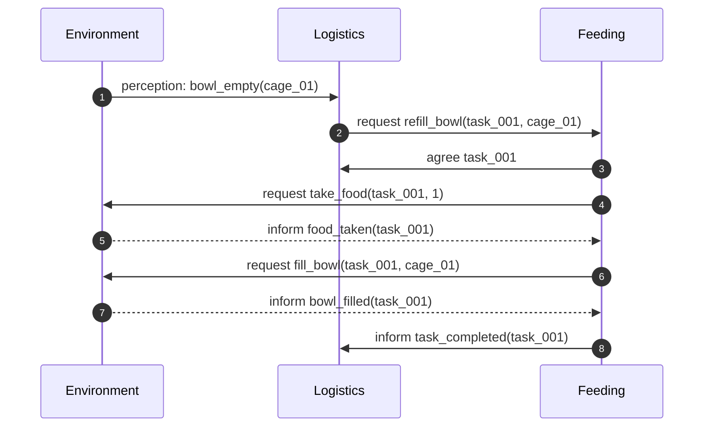

# Primo incremento: alimentazione

## Obiettivo

Realizzare la più piccola fetta verticale che dimostri cooperazione tra agenti BDI e modifica controllata dell'ambiente.

**Stato iniziale:** una ciotola nella Cage Area è vuota e il Food Storage contiene almeno una razione.

**Stato finale:** la ciotola è piena, il magazzino contiene una razione in meno e il task risulta completato una sola volta.

## Dentro e fuori dallo scope

| Incluso | Escluso per ora |
|---|---|
| Un Logistics Agent | Più agenti dello stesso ruolo |
| Un Feeding Agent | Veterinari e cure mediche |
| Un Environment Agent | Lock distribuiti e semafori |
| Una gabbia e una ciotola | Pathfinding avanzato |
| Food Storage con quantità finita | Grafica definitiva e animazioni |

## Flusso dello scenario



## Responsabilità BDI

### Logistics Agent

| Elemento | Contenuto minimo |
|---|---|
| Belief | `bowl_empty(cage_01)` |
| Goal | `ensure_food(cage_01)` |
| Piano | Creare un task e richiedere Feeding |
| Successo | Ricevere `task_completed(TaskId)` |
| Fallimento | Ricevere rifiuto o superare il timeout |

### Feeding Agent

| Elemento | Contenuto minimo |
|---|---|
| Belief | `feeding_task(TaskId, CageId)` |
| Goal | `complete_feeding(TaskId)` |
| Piano | Prendere cibo e riempire la ciotola |
| Successo | Ambiente conferma `bowl_filled` |
| Fallimento | Cibo esaurito o azione rifiutata |

## Contratti minimi

| Ontologia | Performative | Mittente → destinatario | Effetto atteso |
|---|---|---|---|
| `cras.feeding` | `request` | Logistics → Feeding | Proposta di un task identificato |
| `cras.feeding` | `agree/refuse` | Feeding → Logistics | Accettazione o rifiuto esplicito |
| `cras.environment` | `request` | Feeding → Environment | Richiesta di un'azione sul mondo |
| `cras.environment` | `inform/failure` | Environment → Feeding | Esito con stato aggiornato o causa |
| `cras.feeding` | `inform` | Feeding → Logistics | Chiusura del task |

Ogni messaggio dello stesso flusso deve condividere `conversation-id = task_id`.

## Ordine di implementazione

1. Scrivere i test del dominio per `take_food` e `fill_bowl`.
2. Implementare l'Environment Agent e verificare le azioni via messaggio.
3. Implementare il Feeding Agent con piano BDI e custom actions Python.
4. Implementare il Logistics Agent e il trigger della percezione.
5. Aggiungere lo scenario completo e solo dopo una vista grafica minima.

## Criteri di accettazione

- Con cibo disponibile, una ciotola vuota diventa piena.
- La quantità nel Food Storage diminuisce esattamente di una unità.
- Tutti i messaggi dello scenario usano lo stesso `task_id`.
- Un secondo messaggio duplicato non consuma un'altra razione.
- Senza cibo, il task fallisce con un esito esplicito e lo stato resta coerente.

## Log atteso

Il log deve permettere di ricostruire lo scenario senza osservare la GUI:

```text
task=task-001 agent=logistics-1 event=feeding_requested cage=cage-01
task=task-001 agent=feeding-1 event=task_accepted
task=task-001 agent=environment event=food_taken quantity=1
task=task-001 agent=environment event=bowl_filled cage=cage-01
task=task-001 agent=feeding-1 event=task_completed
```

