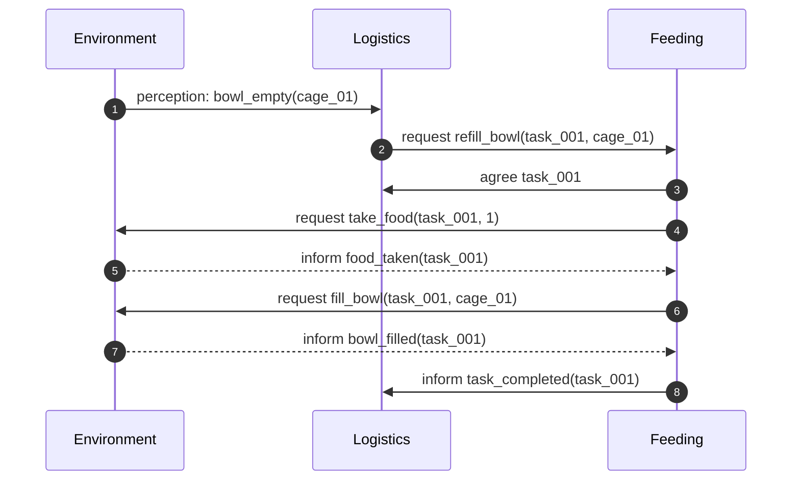

# Primo incremento: alimentazione

## Stato di implementazione

**Completato.** Il workflow è eseguibile con:

```powershell
.\.my_sdai\Scripts\python.exe -m tamagotchi_wild
```

L'implementazione comprende:

- `logistics.asl`: belief `bowl_empty`, goal `ensure_food` e richiesta al Feeding;
- `feeding.asl`: belief `feeding_task`, goal `complete_feeding` ed esito BDI;
- messaggi SPADE/XMPP con ontologie `cras.perception`, `cras.feeding` e `cras.environment`;
- azioni atomiche `take_food` e `fill_bowl`, idempotenti per `task_id`, e
  transizione controllata a `rejected` in caso di fallimento;
- test end-to-end per successo e assenza di cibo.

## Obiettivo

Realizzare la più piccola fetta verticale che dimostri cooperazione tra agenti BDI e modifica controllata dell'ambiente.

**Stato iniziale:** una ciotola nella Cage Area è vuota e il Food Storage contiene almeno una razione.

**Stato finale:** la ciotola è piena, il magazzino contiene una razione in meno e il task risulta completato una sola volta.

## Dentro e fuori dallo scope

| Incluso | Escluso per ora |
|---|---|
| Un Logistics Agent | Più agenti dello stesso ruolo |
| Un Feeding Agent | Veterinari e cure mediche |
| Un Environment Agent | Lock distribuiti e semafori |
| Una gabbia e una ciotola | Pathfinding avanzato |
| Food Storage con quantità finita | Grafica definitiva e animazioni |

## Flusso dello scenario



## Responsabilità BDI

### Logistics Agent

| Elemento | Contenuto minimo |
|---|---|
| Belief | `bowl_empty(TaskId, CageId, BowlId)` |
| Goal | `ensure_food(TaskId, CageId, BowlId)` |
| Piano | Creare un task e richiedere Feeding |
| Successo | Ricevere `task_completed(TaskId)` |
| Fallimento | Ricevere rifiuto o superare il timeout |

### Feeding Agent

| Elemento | Contenuto minimo |
|---|---|
| Belief | `feeding_task(TaskId, CageId, BowlId)` |
| Goal | `complete_feeding(TaskId, CageId, BowlId)` |
| Piano | Prendere cibo e riempire la ciotola |
| Successo | Ambiente conferma `bowl_filled` |
| Fallimento | Cibo esaurito o azione rifiutata |

## Contratti minimi

| Ontologia | Performative | Mittente → destinatario | Effetto atteso |
|---|---|---|---|
| `cras.feeding` | `request` | Logistics → Feeding | Proposta di un task identificato |
| `cras.feeding` | `agree/refuse` | Feeding → Logistics | Accettazione o rifiuto esplicito |
| `cras.environment` | `request` | Feeding → Environment | Richiesta di un'azione sul mondo |
| `cras.environment` | `inform/failure` | Environment → Feeding | Esito con stato aggiornato o causa |
| `cras.feeding` | `inform/failure` | Feeding → Logistics | Chiusura o fallimento esplicito del task |

Ogni messaggio dello stesso flusso deve condividere `conversation-id = task_id`.

## Ordine di implementazione

1. ~~Scrivere i test del dominio per `take_food` e `fill_bowl`.~~ **Completato.**
2. ~~Implementare l'Environment Agent e verificare le azioni via messaggio.~~ **Completato.**
3. ~~Implementare il Feeding Agent con piano BDI e custom actions Python.~~ **Completato.**
4. ~~Implementare il Logistics Agent e il trigger della percezione.~~ **Completato.**
5. ~~Aggiungere lo scenario completo.~~ **Completato; la vista grafica resta fuori scope.**

## Criteri di accettazione

- ✅ Con cibo disponibile, una ciotola vuota diventa piena.
- ✅ La quantità nel Food Storage diminuisce esattamente di una unità.
- ✅ Tutti gli 8 messaggi dello scenario usano `conversation-id = task_001`.
- ✅ Un secondo messaggio duplicato non consuma un'altra razione.
- ✅ Senza cibo, il task passa a `rejected` con `not enough food` e lo stato resta coerente.

## Log atteso

Il log deve permettere di ricostruire lo scenario senza osservare la GUI:

```text
task=task_001 agent=logistics_01 event=feeding_requested cage=cage_01
task=task_001 agent=feeding_01 event=task_accepted
task=task_001 agent=environment event=food_taken quantity=1
task=task_001 agent=environment event=bowl_filled cage=cage_01
task=task_001 agent=feeding_01 event=task_completed
```
