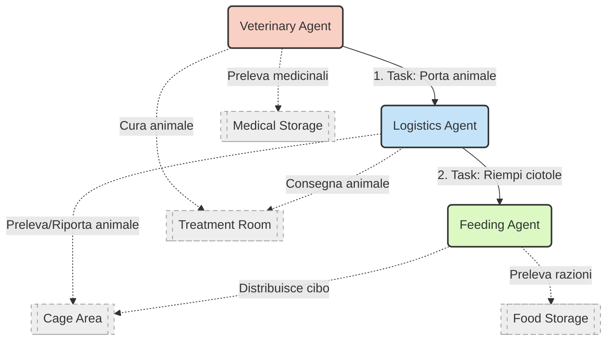
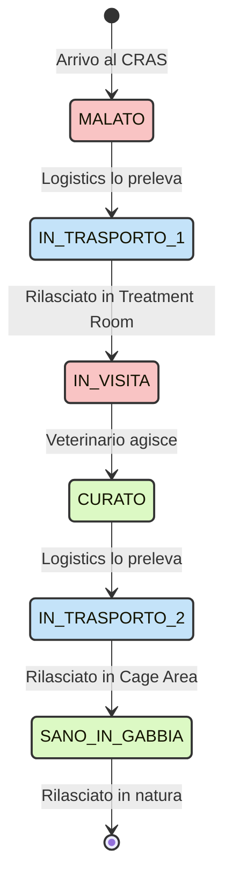
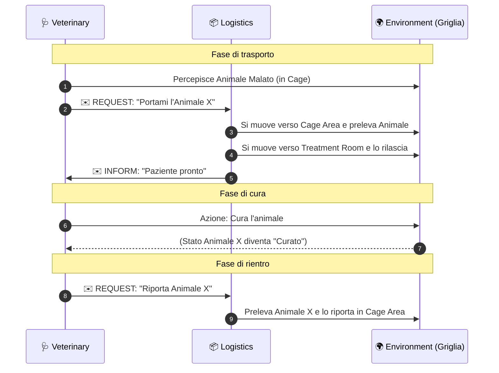
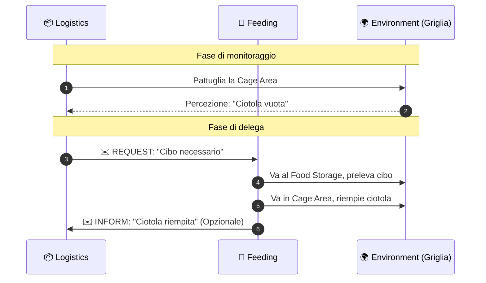

# Schemi e Flussi: Wildlife Rescue Center (CRAS)

## Stato di implementazione

Lo scenario **Cure Mediche** descritto in questo documento è implementato e
testato. Veterinary e Logistics usano piani AgentSpeak reali, mentre Environment
valida ogni transizione dell'animale e conserva lo stato autorevole.

Esecuzione:

```powershell
.\.my_sdai\Scripts\python.exe -m tamagotchi_wild
```

Risultato verificato: animale `sick → in_outbound_transport → in_treatment →
treated → in_return_transport → healthy`, restituito alla posizione della gabbia.

Questo documento illustra l'architettura logica, i ruoli degli agenti, la macchina a stati degli animali e i diagrammi di sequenza del sistema.

## 1. Dettaglio degli Operatori (Agenti) e Interazioni



### 🩺 Veterinary Agent (Veterinario)
* **Dove può muoversi:** `Treatment Room`, `Medical Storage`.
* **Cosa percepisce:** Salute degli animali, disponibilità medicinali.
* **Azioni fisiche:** Preleva medicinali, Cura l'animale (cambia stato).
* **Comunicazioni:** Richiede alla Logistica di portare/riportare un animale.

### 📦 Logistics Agent (Addetto Logistica)
* **Dove può muoversi:** `Cage Area`, `Treatment Room`.
* **Cosa percepisce:** Stato gabbie (ciotole, presenza animali), messaggi ricevuti.
* **Azioni fisiche:** Carica, trasporta e scarica animali.
* **Comunicazioni:** Conferma consegna paziente, Delega riempimento cibo al Feeding Agent.

### 🍎 Feeding Agent (Addetto Alimentazione)
* **Dove può muoversi:** `Food Storage`, `Cage Area`.
* **Cosa percepisce:** Richieste della Logistica, quantità di cibo.
* **Azioni fisiche:** Preleva cibo, Riempie ciotole.

---

## 2. Ciclo di Vita dell'Animale (Risorsa Passiva)

L'animale non prende decisioni; il suo stato viene modificato esclusivamente dalle azioni degli agenti sull'ambiente.



---

## 3. Diagrammi di Sequenza (Flussi Operativi)

### A) Scenario "Cure Mediche"


### B) Scenario "Nutrizione"

